# Penjelasan Praktikum Probstat Modul 1
### Nama : Christopher Clement Wijaya
### NRP : 5025211155
___
# 1. Probabilitas seorang bayi yang baru lahir berjenis kelamin laki-laki adalah 0,488. Jika kita asumsikan bahwa dalam satu hari di rumah sakit terdapat 10 kelahiran, maka:

### a. Bagaimana pendistribusian banyak bayi laki-laki? Tentukan distribusi dengan parameter yang sesuai.

Untuk X = Variabel random untuk jumlah bayi baru lahir yang berjenis kelamin laki-laki **dalam 1 hari**, maka :
- X = {0, 1, 2, 3, 4, 5, 6, 7, 8, 9, 10}
- p = 0,488
- n = 10

Maka, karena **p** adalah probabilitas untuk 1 bayi sedangkan terdapat lebih dari 1 kelahiran dalam 1 hari, maka distribusi yang sesuai adalah `distribusi binomial` :
- `b(x;n,p)`
    - x = Jumlah bayi baru lahir berjenis kelamin laki-laki
    - n = Jumlah percobaan (10)
    - p = Probabilitas bayi baru lahir berjenis kelamin laki-laki

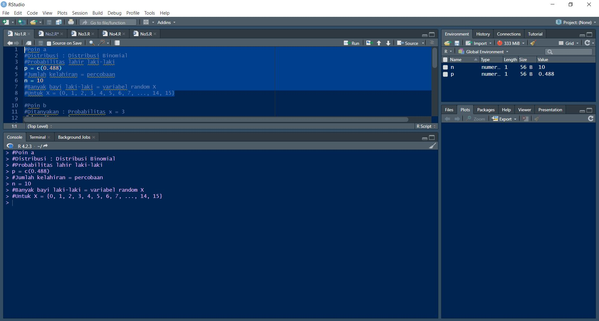

### b. Berapa probabilitas bahwa tepat tiga bayi di antaranya berjenis kelamin laki-laki?
- Dit : Nilai dari **P(X = 3)**. 

Maka, jawaban bisa ditemukan menggunakan fungsi `dbinom` yang mengembalikan nilai **P(X = x)**. **Akan digunakan x = 3**.

Berikut syntax fungsi tersebut :
```
dbinom(x,           # X-axis values (x = 0, 1, 2, ..., n)
       size,        # Number of trials (n > = 0)
       prob,        # The probability of success on each trial
       log = FALSE) # If TRUE, probabilities are given as log
```

### c. Berapa probabilitas bahwa kurang dari tiga bayi di antaranya berjenis kelamin laki-laki?
- Dit : Nilai dari **P(X < 3)**. 


Maka, jawaban bisa ditemukan menggunakan fungsi `pbinom` yang mengembalikan nilai **P(X <= x)**. **Akan digunakan x = 2**.

Berikut syntax fungsi tersebut :
```
pbinom(q,                 # Quantile or vector of quantiles
       size,              # Number of trials (n > = 0)
       prob,              # The probability of success on each trial
       lower.tail = TRUE, # If TRUE, probabilities are P(X <= x), or P(X > x) otherwise
       log.p = FALSE)     # If TRUE, probabilities are given as log
```


### d. Berapa probabilitas bahwa tiga atau lebih bayi di antaranya berjenis kelamin laki-laki?
- Dit : Nilai dari **P(X >= 3)**. 

Maka, jawaban bisa ditemukan menggunakan fungsi `pbinom` yang mengembalikan nilai **P(X <= x)**.
Akan dihitung **P(X >= 3) = 1 - P(X <= 2)**

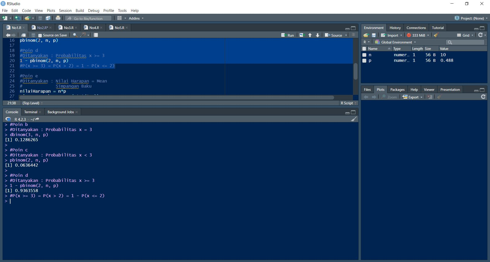

### e. Berapa nilai harapan dan simpangan baku banyak bayi laki-laki?

- Diketahui μ = np and σ^2 = npq
    - μ = Rata-rata
    - σ^2 = Varians

Maka, karena nilai harapan adalah rata-rata, bisa ditemukan nilai keduanya seperti di gambar di bawah.


### f. Gambarkan histogram pendistribusian banyak bayi laki-laki.
```
x = 0:n
plot(x, dbinom(x, n, p), type='h', lwd = 2, main = "Distribusi Banyak Bayi Laki-laki", ylab = "P(X = x)", xlab = "Jumlah bayi laki-laki")
```
Argumen :
- x = {0, 1, 2, ..., n}
- dbinom = Fungsi yang digunakan untuk menghitung nilai y = f(x) untuk setiap nilai x.
- type : Jenis plot, `h` berarti histogram.
- lwd : Line width.
- main, ylab, xlab : Judul plot, sumbu y, dan sumbu x.

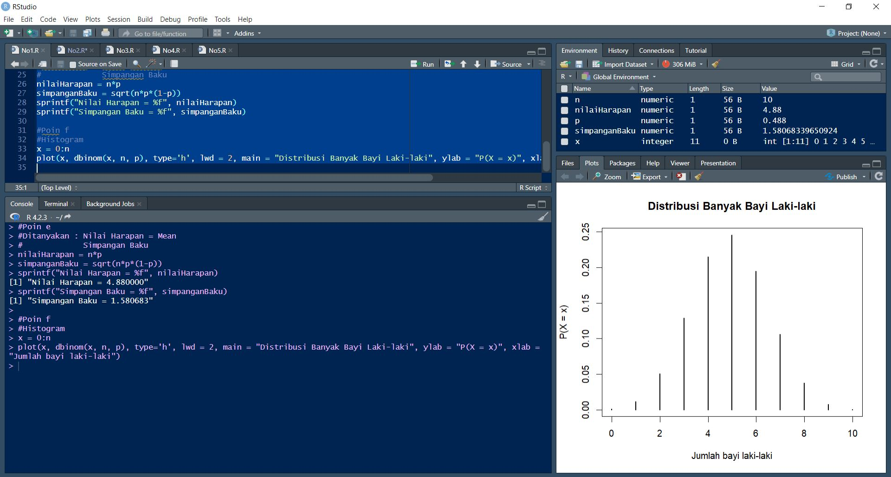
___
# 2. Misalkan banyak kematian karena kanker tulang untuk seluruh pekerja di pabrik ban dalam 20 tahun ke depan adalah 1,8.

### a. Bagaimana pendistribusian banyak kematian karena kanker tulang? Tentukan distribusi dengan parameter yang sesuai.
Untuk **X = Variabel random jumlah kematian pekerja pabrik ban karena kanker tulang dalam 20 tahun**, karena yang diketahui adalah hasil pengamatan **dalam rentang waktu 20 tahun**, maka digunakan `distribusi poisson` :
- `p(x; λt)`
    - x = Jumlah kejadian dalam interval **t**.
    - t = Interval waktu.
    - λ = Rata-rata jumlah kejadian per unit waktu.
- Nilai dalam soal ini
    - t = `20` (20 tahun).
    - λ = **1,8/20** = `0,09` (Jumlah kematian **per tahun**) 

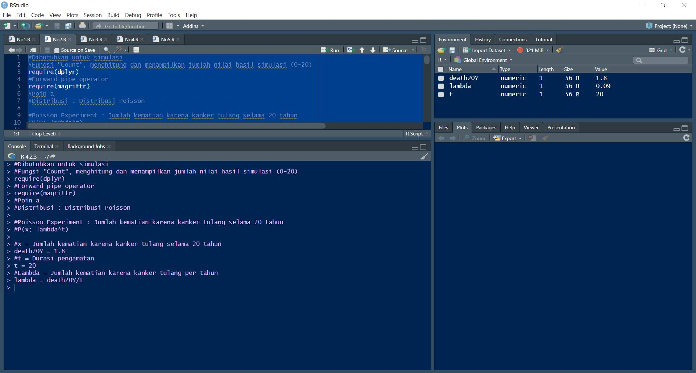
### b. Ada 4 kematian akibat kanker tulang yang dilaporkan di kalangan pekerja pabrik ban, apakah itu peristiwa yang tidak biasa? Hitung probabilitas berdasarkan distribusi yang telah dipilih.

- Dit : Nilai dari **P(X = 4)**. 

Maka, jawaban bisa ditemukan menggunakan fungsi `dpois` yang mengembalikan nilai **P(X = x)**. **Akan digunakan x = 4**.

Berikut syntax fungsi tersebut :
```
dpois(x,           # X-axis values (x = 0, 1, 2, ...)
      lambda,      # Mean number of events that occur on the interval
      log = FALSE) # If TRUE, probabilities are given as log
```
### c. Berapa peluang paling banyak 4 kematian akibat kanker tulang?
- Dit : Nilai dari **P(X <= 4)**. 


Maka, jawaban bisa ditemukan menggunakan fungsi `ppois` yang mengembalikan nilai **P(X <= x)**. **Akan digunakan x = 4**.

Berikut syntax fungsi tersebut :
```
ppois(q,                 # Quantile or vector of quantiles
      lambda,            # Mean or vector of means
      lower.tail = TRUE, # If TRUE, probabilities are P(X <= x), or P(X > x) otherwise
      log.p = FALSE)     # If TRUE, probabilities are given as log
```
### d. Berapa peluang lebih dari 4 kematian akibat kanker tulang?
- Dit : Nilai dari **P(X > 4)**. 


Maka, jawaban bisa ditemukan menggunakan fungsi `ppois`. **Akan digunakan x = 4** dengan `lower.tail = false` untuk memberi nilai **P(X > x**).

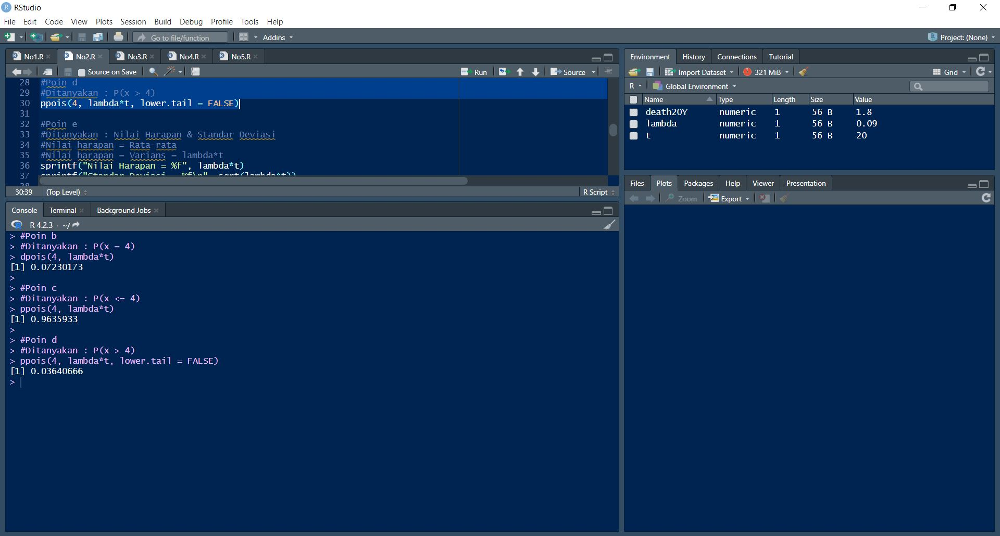

### e. Berdasarkan distribusi yang telah dipilih, berapakah nilai harapan dan standar deviasi banyak kematian akibat kanker tulang untuk pekerja pabrik ban?
- **Rata-rata dan varians** dari distribusi poisson **p(x; λt)** adalah **λt**.

Maka bisa ditemukan nilai harapan (rata-rata) dan standar deviasi sebagai berikut :
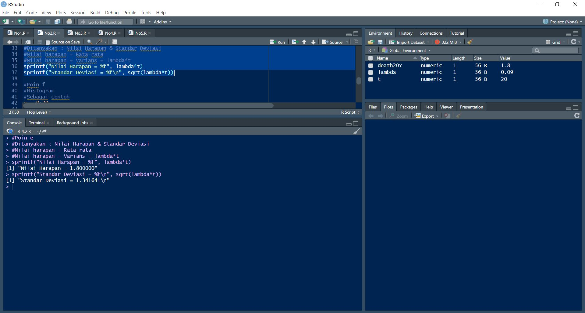
### f. Gambarkan histogram pendistribusian banyak banyak kematian akibat kanker tulang untuk pekerja pabrik ban.
```
x = 0:20
plot(x, dpois(x, lambda*t), type = "h", lwd = 2,
     main = "Distribusi banyak kematian pekerja akibat kanker tulang",
     ylab = "P(X = x)", xlab = "Banyak kematian")
```
Argumen :
- x = {0, 1, 2, ..., 20}
- dpois = Fungsi yang digunakan untuk menghitung nilai y = f(x) untuk setiap nilai x.
- type : Jenis plot, `h` berarti histogram.
- lwd : Line width.
- main, ylab, xlab : Judul plot, sumbu y, dan sumbu x.

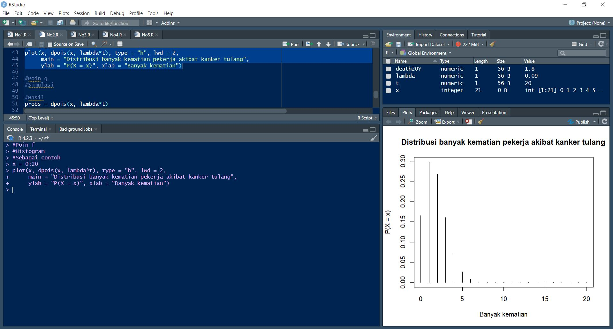
___
### g. Gunakan simulasi untuk memeriksa hasil sebelumnya.
```
probs = dpois(x, lambda*t)
prob_dist = sample(x,10000,prob=probs,replace=T)
data <- data.frame(prob_dist)
hist(prob_dist)
data %>% group_by(prob_dist) %>% count(prob_dist)
```
Penjelasan :
- probs = Vektor berisi probabitas dalam 20 tahun terdapat x kematian untuk x = {0, 1, 2, .., 20}.
- prob_dist = Berisi vektor hasil sampling untuk :
    - x = Vektor elemen yang bisa dipilih (jumlah kematian).
    - 10000 = Jumlah sampel yang diambil.
    - prob = Vektor berisi probabilitas terpilihnya elemen-elemen yang akan disampel.
    - replace = T, berarti setelah suatu elemen terpilih, bisa dipilih lagi.
- data = Menyimpan data frame dari data hasil sampling.
- hist = Menghasilkan histogram hasil sampling.
- `data %>% group_by(prob_dist) %>% count(prob_dist)` = Menggunakan *forward pipe*, menampilkan jumlah hasil sampling untuk setiap nilai **x**.
### h. Jelaskan banyak kematian akibat kanker tulang berdasarkan simulasi Anda. Bandingkan jawaban pada pertanyaan 2d dengan hasil simulasi Anda.
Dari simulasi 10000 sampel acak dengan probabilitas sesuai distribusi poison p(x;1,8) untuk jumlah kematian 0-20, dibuktikan bahwa jumlah kematian yang paling mungkin terjadi adalah 0 - 4 dengan untuk kemungkinan jumlah kematian 5 ke atas dibawah 1%.

Hal ini berarti hasil simulasi sesuai dengan no 2d.

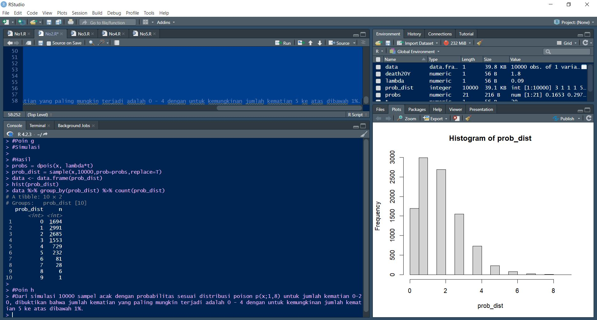
# 3. Diketahui nilai x = 3 dan v = 10. Tentukan:
### a. Fungsi probabilitas dari distribusi Chi-Square.
- Dik :
    - x = 3
    - v = 10
Maka, jawaban bisa ditemukan menggunakan fungsi `dchisq`.

Berikut syntax fungsi tersebut :
```
dchisq(x,
        df, #Standar Deviasi
        ncp = 0, 
        log = FALSE)
```


### b. Histogram dari distribusi Chi-Square dengan 500 data acak.
Data acak yang mengikuti distribusi Chi-Square bisa dihasilkan menggunakan fungsi `rchisq`.

Histogram sendiri bisa juga dibuat menggunakan fungsi `hist`

Berikut syntax fungsi tersebut :
```
hist(x, …)
# S3 method for default
hist(x, 
    breaks = "Sturges",
     freq = NULL, probability = !freq,
     include.lowest = TRUE, right = TRUE,
     density = NULL, angle = 45, col = NULL, border = NULL,
     main = paste("Histogram of" , xname),
     xlim = range(breaks), ylim = NULL,
     xlab = xname, ylab,
     axes = TRUE, plot = TRUE, labels = FALSE,
     nclass = NULL, warn.unused = TRUE, …)
```
- breaks = (Jika berupa 1 angka) Jumlah batang histogram.

### c. Nilai rataan (μ) dan varian (σ²) dari distribusi Chi-Square.
- Diketahui μ = v and σ^2 = 2v.

Maka kedua nilai tersebut bisa dihitung sebagai berikut :
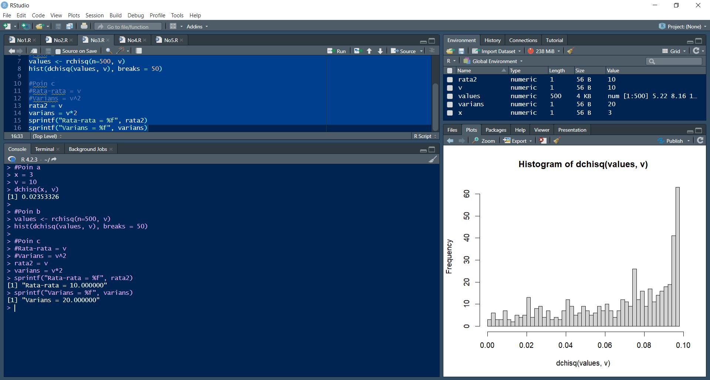

# 4. Diketahui data bangkitan acak sebanyak 100 dengan mean = 45 dan sd = 5. Tentukan:
Untuk menghasilkan data acak yang berdistribusi normal dengan **mean** dan **standar deviasi** tertentu, akan digunakan fungsi sebagai berikut :
```
rnorm_fixed <- function(n, mean, sd) {    # Create user-defined function
  as.vector(mean + sd * scale(rnorm(n)))
}
```
Fungsi diatas digunakan untuk menghasilkan data acak yang berdistribusi normal dengan mean dan standar deviasi **yang lebih akurat** dibandingkan jika hanya menggunakan `rnorm(n, mean, sd)`.
___
### a. Fungsi probabilitas dari distribusi Normal P(X1 ≤ x ≤ X2), hitung z-scorenya dan plot data bangkitan acaknya dalam bentuk grafik. Petunjuk (gunakan fungsi plot()).

- Keterangan:
    - X1 = Bilangan bulat terdekat di bawah rata-rata
    - X2 = Bilangan bulat terdekat di atas rata-rata
- Contoh data:
```
11
1,2,4,2,6,3,10,11,5,3,6,8
rata-rata = 5.083333
X1 = 5
X2 = 6
```
Langkah pertama adalah untuk menghasilkan bangkitan acak sebanyak **100** dengan **mean = 45** dan **sd = 5** menggunakan fungsi diawal.

Langkah kedua adalah mengurutkan data acak tersebut, lalu mencari nilai `X1` dan `X2`.

Setelah itu, bisa dicari nilai **P(X1 ≤ x ≤ X2)**, **nilai z score** dari nilai sebelumnya (Distribusi standar normal, mean = 0 dan sd = 1), dan **plot bangkitan acaknya**.

Berikut penjelasan args untuk fungsi `plot`
```
plot(randObs, #Hasil bangkitan acak
 dnorm(randObs, mean, sd), #Nilai distribusi normalnya untuk mean = 45 dan sd = 5
 type = "l", #Tipe plot adalah garis
 ylim = c(0, 0.15), #Batas bawah dan atas sumbu y
 ylab = "", lwd = 2, col = "red") #Warna dan lebar garis
```
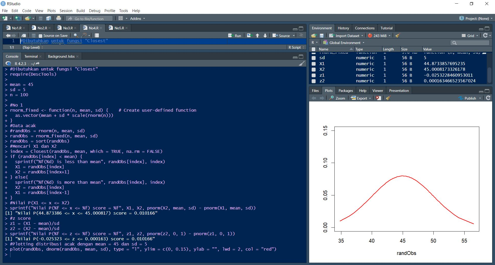
### b. Gambarkan histogram dari distribusi Normal dengan breaks 50

Soal ini bisa diselesaikan menggunakan fungsi `hist`.

### c. Nilai varian (σ²) dari hasil data bangkitan acak distribusi Normal.
- *The mean and variance of n(x; μ, σ) are μ and σ^2, respectively. Hence, the standard deviation is σ.*

Maka, varians bisa dihitung sebagai sd^2.
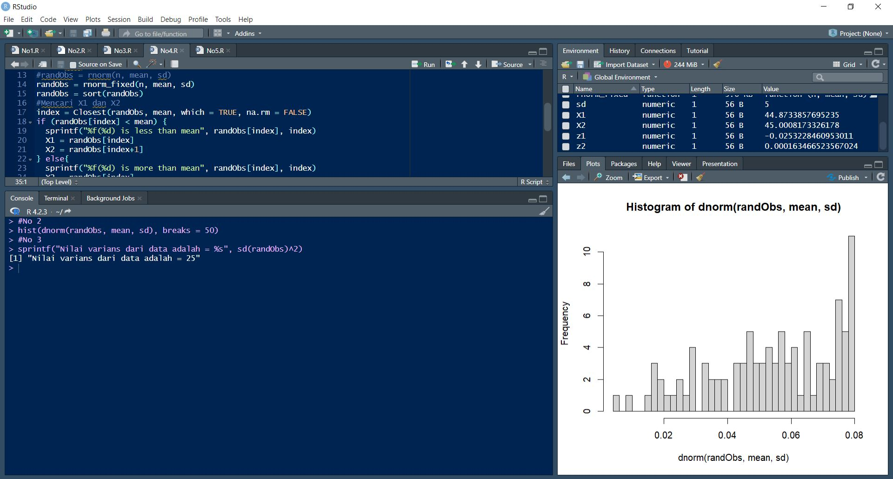
# 5. Kerjakanlah menggunakan distribusi T-Student.
Dalam pengerjaannya, akan digunakan fungsi `pt` dan `qt`. 
- `pt(x, df, lower.tail = FALSE) ` = Mengembalikan area dikiri nilai x.
- `qt(a, df)` = Merupakan fungsi invers dari `pt`, mengembalikan nilai x yang area dikirinya bernilai a.
### a. Berapa probabilitas terjadinya suatu peristiwa acak X kurang dari -2,34 dengan 6 derajat kebebasan?
- Dit = Area untuk (x < -2,34) dengan v = 6.
### b. Berapa probabilitas terjadinya suatu peristiwa acak X lebih dari 1,34 dengan 6 derajat kebebasan?
- Dit = Area untuk (x > 1,34) dengan v = 6.
### c. Berapa probabilitas terjadinya suatu peristiwa acak X kurang dari -1,23 atau lebih besar dari 1,23 dengan 3 derajat kebebasan?
- Dit = Area untuk (x < -1,23  DAN x > 1,23) dengan v = 3.
### d. Berapa probabilitas terjadinya suatu peristiwa acak X berada di antara -0,94 dan 0,94 dengan 14 derajat kebebasan?
- Dit = Area untuk (-0,94 < x < 0,94) dengan v = 14.

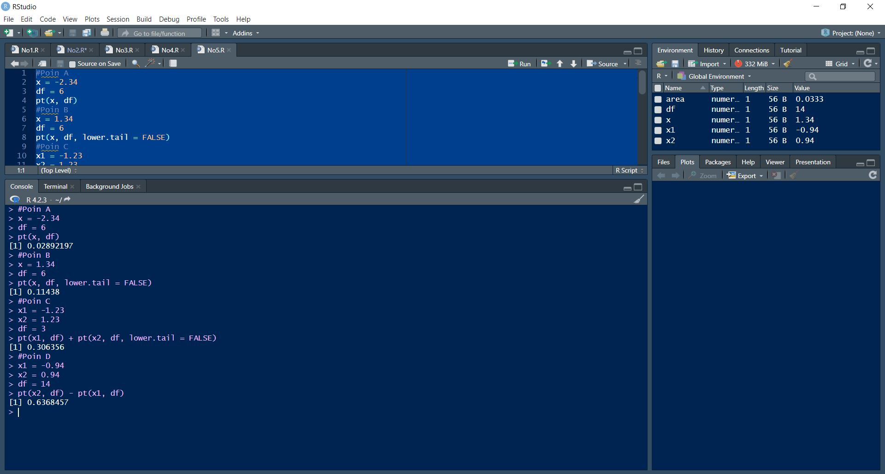
### e. Berapa nilai t-score dengan 5 derajat kebebasan yang memiliki luasan 0,0333 satuan persegi di bawah kurva dan di sebelah kiri t-score tersebut?
- Dit = Nilai y untuk a = 0,0333 dengan (x < y) dan v = 5.
### f. Berapa nilai t-score dengan 25 derajat kebebasan yang memiliki luasan 0,125 satuan persegi di bawah kurva dan di sebelah kanan t-score tersebut?
- Dit = Nilai y untuk a = 0,125 dengan (x > y)  dan v = 25.
### g. Berapa nilai t-score dengan 11 derajat kebebasan yang memiliki luasan 0,75 satuan persegi di bawah kurva dan di antara t-score tersebut dan negatif dari nilai t-score tersebut?
- Dit = Nilai y untuk a = 0,75 dengan (-y < x < y) dan v = 11.
### h. Berapa nilai t-score dengan 23 derajat kebebasan yang memiliki luasan 0,0333 satuan persegi di bawah kurva dan di luar interval antara t-score tersebut dan negatif dari nilai t-score tersebut?
- Dit = Nilai y untuk a = 0,0333 dengan (x < -y,23  DAN x > y) dan v = 23.

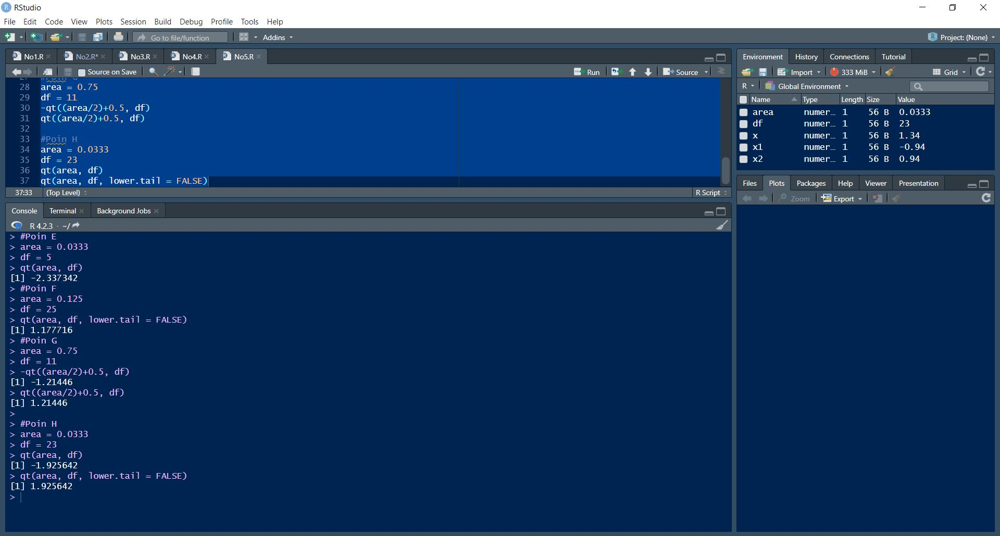
